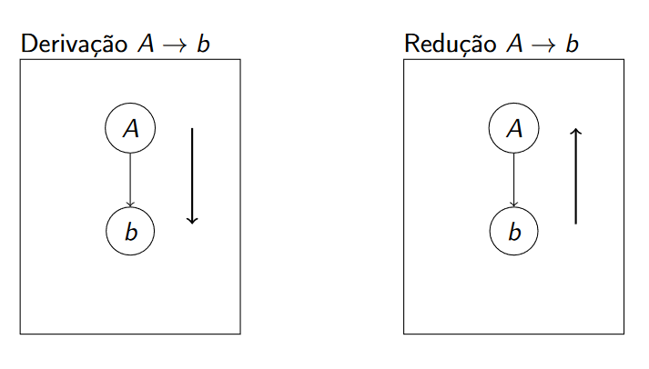
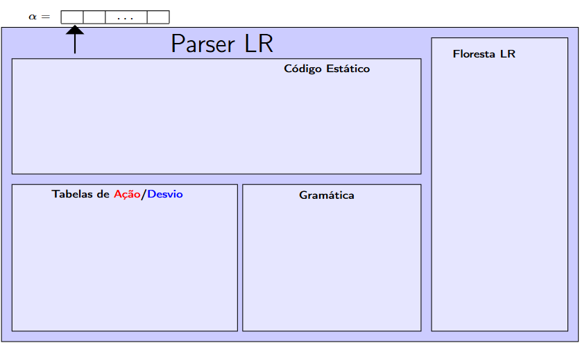

# Analisadores Sintáticos Ascendentes

- Analisadores Sintáticos Ascendentes constróem a árvore de derivação da direita para esquerda.

- Destacam-se os LR(left to right)

- Um analisador ascendente usa reduções.

## Parser LR

COMPONENTS

1. Entrada: Contém alfa;
2. Parser: código executável;
3. Floresta: estrutura de dados auxiliar;
4. Tabela de ações: matriz obtida a partir de G;
5. Tabela de Desvios: matriz obtida a partir de G;

Graficamente

### Tabela de desvios

- Representação de um grafo com uma tabela
- LINHAS = Vértices, COLUNAS = Variáveis e terminais da grámatica

EX: Considere a gramática G abaixo e tabela de desvios obtida a partir dela

### Tabela de Ações

A tabela de ações indica o que dese ser feito em um vértice do grafo em função do token da entrada

1. e(empilha)
2. R(Reduz)
3. A(Aceito)
4. erro

EMPILHA

-> Cria um nova árvore com token atual

-> Consome token

REDUZ

-> Executa a redução indicada

ACEITA

-> Indica que àrvore foi construída

### Tabelas

- As tabelas são obtidas a partir da gramática
- Se mudar a gramática, mudam as tabelas

>> Para ocupar menos espaços, é comum combinar as tabelas em uma só

### Execução

1. Cada passo do parser usa como parâmetros:
    - O token de entrada
    - A floresta de sub-árvores
    - Os estados, que podem ser visto como:
        - Uma linha da tabela
        - O estado indicado no topo de cada árvore(cada árvore tem
que ter um estado no topo)

Fzer no papel arvore

Parou Em Implemetação

## Construção de Tabelas

CONCEITOS IMPORTANTES

1 - Estados

2 - Transição

3 - Item

Exemplo de Itens:

Cada produção tem varios itens

Cada estado representa um conjuneto de itens;

Conjuntos no sentido matemático;

### Fecho Transitivo de Itens

- A construção do conjunto de itens válidos para cada estado (e as transições entre eles) é feita a partir de um item inicial daquele estado.

Item inicial do estado 0:  <strong>[L' -> *L#]</strong>

Observe que o * mostra que todas as derivações possíveis a partir de L também são válidas, ou seja, no triângulo de L podem ser encaixados os seguintes itens <strong>[L -> *L,E], [L -> *E#]</strong>

    

