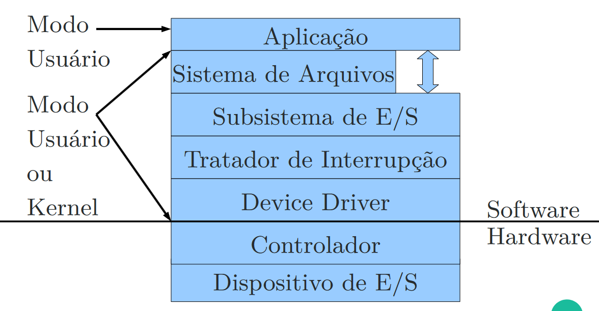
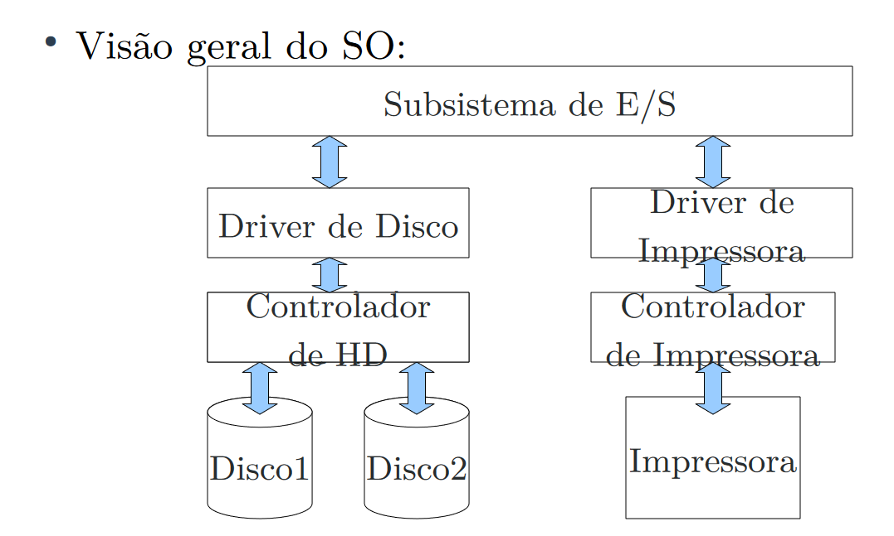
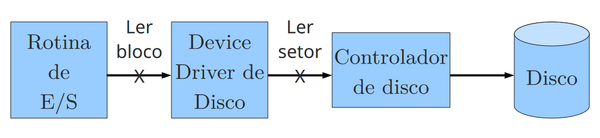
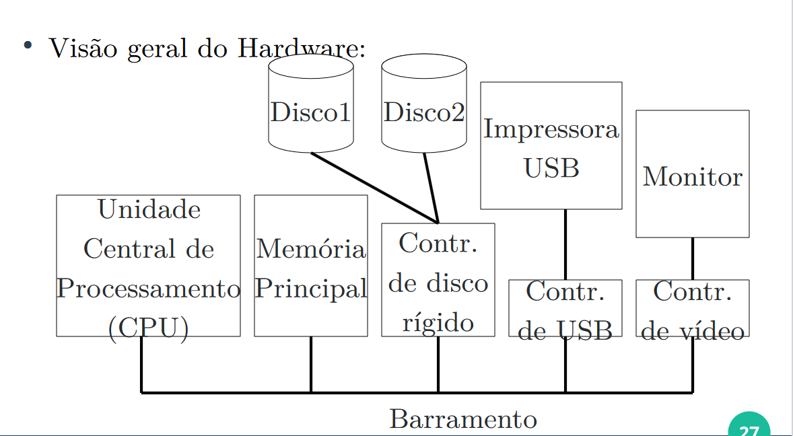
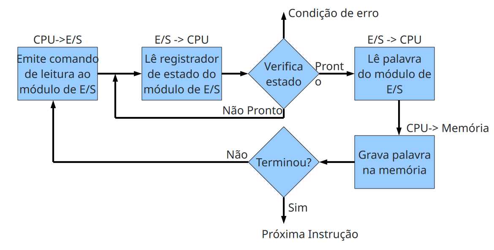
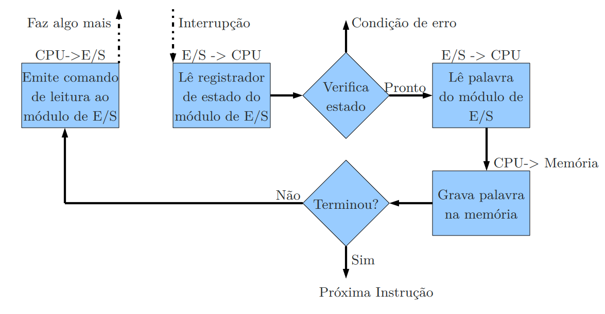
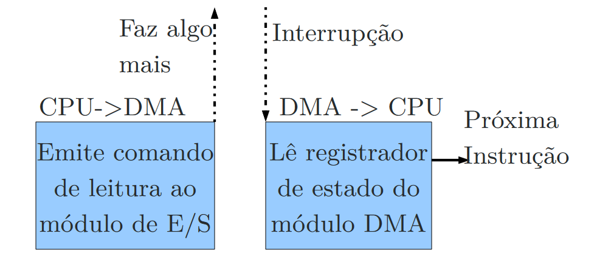

# Gerência de entrada e saída

A gerência de E/S é uma das maiores e mais complexas funções de um SO, pois existe diversos dispositivos de E/S no mercado.

A implementação dessa abstração é divida em múltiplas camadas.

1. Subsistema de E/S: Isola a complexidade dos dispostivos físicos de E/S;
2. Devide Driver: Implementa detalhes de cada periférico em modo protegido;
3. Tratador de Interrupção: Camada que implementa a lógica de interrupções;
4. Controlador e Dispositivo de E/S: O hardware em questão;

Os dispositivos de entrada e saida são divididos na categoria de blocos ou caracteres.

- Blocos: Armazena informações de tamanho fixo, cada uma com seu próprio endereço(Tamanhos entre 512 a 64k)

Cada bloco pode ser lido e escrito independentemente de todos os outros

HDs, Blu-Ray, Pendrives

- Caracteres: Envia e aceia um fluxo de caracteres, desconsiderando qualquer estrutura de bloco

Não é endereçável, não tem operações de busca

Impressoras, interfaces de rede, mouses

## Subsistema de E/S

A comunicação com o Subsistema de E/S é realizado através das rotinas de E/S

Essas rotinas permitem a comunicação com o dispositivo sem se preocupar com detalhes de implementação

    Por exemplo: ao criar um arquivo não é necessário se preocupar com detalhes além do nome e permissões. Trilhas, setores, disco, são calculados pelo SO

As rotinas são independentes do disopositivo, por exemplo, as chamadas de vídeo não dependem se é um monitor LCD, LED ou CRT

As rotinas de E/S podem ser efetuadas diretamente no subsistema de E/S (como para vídeo) ou podem ser executas em uma outra subcamada, como o sistema de arquivos ou a gerência de USB.

Quando as chamadas são realizadas diretamente no subsistema de E/S elas são <strong>chamadas explícitas</strong>

Caso contrário, éuma chamda implícita, onde a partir de alguma chamada de sistema são geradas chamadas para o subsistema de E/S a partir de algum outro módulo do SO

As opercações de E/S também pode ser clasificadas em:

Síncronas: Onde a aplicação aguarda o término ficando em um estado bloquado. A maioiria das chamadas é assim;

Assíncronas: a aplicação continua a execução após realizar a chamada. Neste caso, é necessário implementar uma forma de avisar a aplicação o término da chamada de E/S

Cada dispositivo trabalha com unidade de tamanho diferente. O subsistema de E/S cria uma unidade de transferência básica

Ele repassa as chamadas às camadas inferiores e obtém as informações das camadas superiores sem conhecimento da informação

O tratamento de erro de operações é realizado na camada mais baixa

Porém alguns erros não são tratados e são enviados à camada superior, como erros de permissão

O sistema operacional também é responsável por gerenciar os dispositivos de E/S para diversos usuários e aplicações diferentes.

A principal função do subsistema de E/S é criar uma interface padronizada, independente dos dispositivos, com o device driver.

### Device Driver

O device driver(Drive de dispositivo) tem como função implementar a comunicação do subsistema de entrada e saída com os controladores de E/S

O subsistema de E/S é uma camda genérica e possui uma interface para todos os dispositivos

O driver de despositivo implementa as chamadas específicas do dispositivo, recebendo comandos genéricos e traduzindo para específicos.

Driver de dispositivo lidam com uma classe de dispositivos: um driver SCSI pode lidar com uma classe enorme de HDs

Driver USB estão disponíveis para discos camêras, pendrives, mouse, teclado, etc.

Para lidar com essa situação , os driver são empilhados no sistema operacional, assim como as camadas TCP/IP são empilhados na rede.

Na maioria dos SOs, os devices drives fazem parte do núcleo: Erros nesse trecho podem causar um kernel panic/tela azul

### Controladores de E/S

Geralmente, os dispositivos de E/S são compostos por uma parte mecânica(hardware) e uma parte eletrônica que controla o hardware.

O sistema operacional programa a controladora e não o dispositivo diretamente

O controlador de E/S normalmente está na forma de um chip na placa-mãe, em computadores pessoais

A interface pode ser padronizada entre os dispositivos e a controladora, assim, garantindo a compatibilidade entre as fabricantes.

Controladores de E/S também é chamado de módulo de E/S

O controlador possui memória e registradores próprios usados na execução de instruções enviadas pelo device driver

A principal função do controlador de E/S é receber instruções da/para CPU e repassar para o/do o dispositivo

Durante esse processo, os bytes que são enviados serialmente podem ser unidos em blocos e também pode-se verificar erros de transmissão

Considere que o dispositivo em questão é um monitor LCD:

O monitor recebe caracteres a serem exibidos e gera sinais para modificar a polarização da retroiluminação dos pixels no monitor

O controlador de tela nesse caso é fundamental para a simplificação do processo

Se não fosse ele, o Sistema Operacional deveria calcular explicitamente o campo elétrico de todos os pixels em questão

A comunicação entre o processador é o módulo de E/S pode ser realizada através de 3 possíveis operações:

1. E/S programada;
2. E/S controlada por interrupção
3. Acesso direto à memória(DMA)

Na técnica de E/S programada o processador é utilizado intesamente para realizar a operação de E/S.

Durante o período da operação, a CPU fica a todo momento questionando se o dispositivo está pronto ou não para uma nova operação

E/S dirigida por interrupção

A grande desvantagem da E/S programa é utilizar o tempo do processador para verificar o dispositivo

Um método de interrupção gera uma linha de controle adicional, de forma que o processador pode executar outras funções. Quando o dispositivo terminar, ele gera uma interrupção para o processador

Quando um processador recebe uma interrupção, ele realiza a cópia do módulo de E/S para a memória e posteriormente retoma o processamento que estava executando.

Acesso direto à memória(DMA)

O módulo de E/S usa o barramento de memória quando o processador não está usando.

O módulo é capaz de imitar um processador no que diz a respeito a transferência de dados para a memória

Para implementar o DMA, o processador envia um comando com as seguintes informações:

- Indicação de uma operação de leitura ou escrita, usando a linha de controle

- O endereço do dispositivo de E/S envolvido

- O endereço de memória para o início da leitura ou escrita de dados

- Números de palavras a serem lidas ou escritas

Depois disso o processador continua o trabalho que
quiser executar

O módulo de DMA transfere o bloco de dados diretamente de/para a memória sem passar pelo processador

Quando a transferência termina, o módulo de DMA envia um sinal de interrupção ao processador

Assim o processador é envolvido apenas no início e final de cada transferência

### Tratador Interrupção

Processo de tratamento de interrupção:

- Salvar quais registros que ainda não foram salvos

- Estabelecer um contexto para a rotina de tratamento de interrupção

- Sinalizador o controlador de interrupção

- O copiar os registradores de onde eles foram salvos(pilha no hardware) para a tabela de processos

- Executar a rotina de tratamento de interrupções, utilizando as informações dada pelo computador

