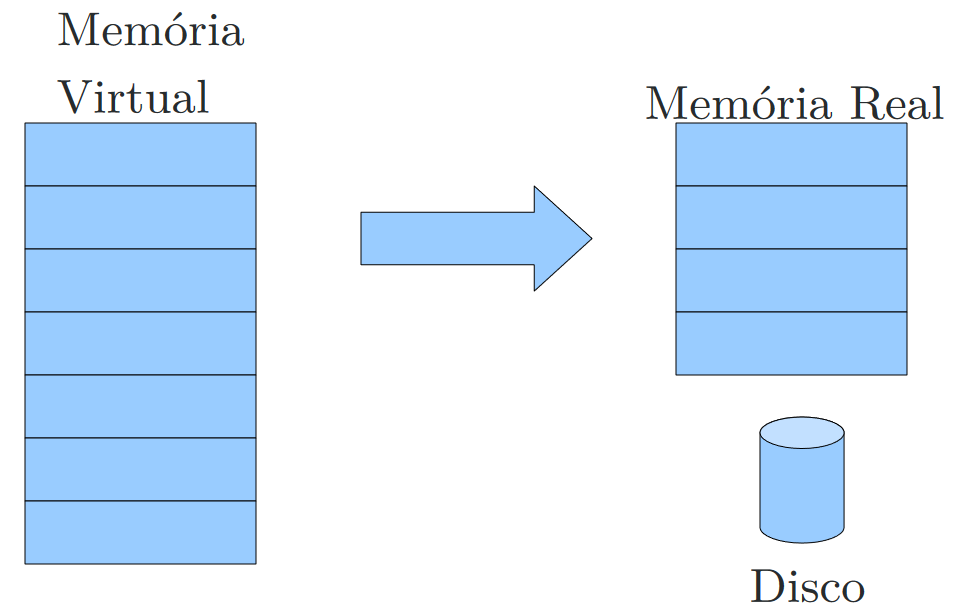
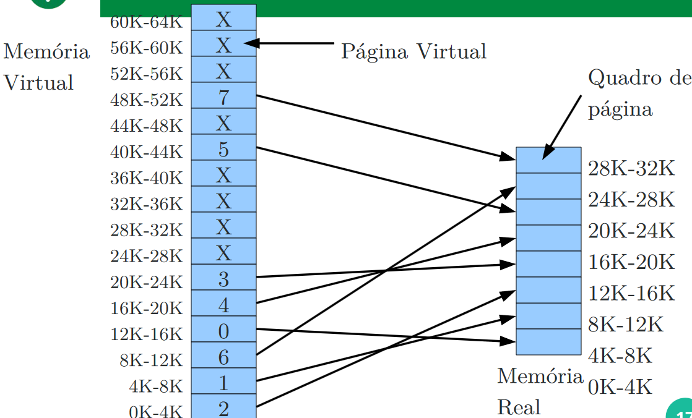
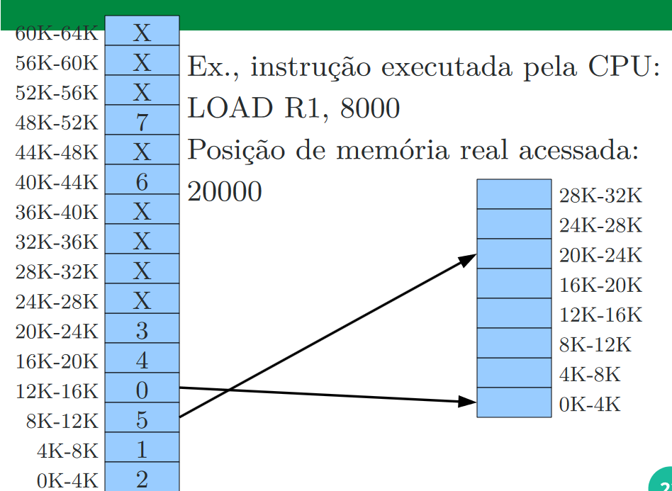

# Gerência de Memória

O foco da gerência de memoria é da memória principal(Memória RAM)

Programas são armazenados em memória secundária e precisam ser transferidos para a memória principal

A gerência de memoria deve manter o maior número de processos residentes, buscando maximizar o compartilhamento de recursos

Também possui algumas funções secundárias que não dependem do esquema de gerência, como:

    - Controlar a alocação de pedaçoes de memória a processos
    - Liverar pedaçoes de memória alocados a processos que não são mais necessários

## Sem abstração de Memória

Dois programas não podem executar ao mesmo tempo

Se um programa escreve um valor uma posição, o outro programa irá sobreescrever esse valor alguma hora

### Alocação contígua simples

Nesse modelo o SO pode estar na parte inferior da memória e o restante está disponível para o usuário

Erros nos programas podem causar falhas gerais no sistema.

Uma outra forma de proteção é manter o SO em uma região de memória de apenas leitura(ROM - Read Only Memory)

Organização onde temos drives de dispositivos em memoria de leitura

O SO em leitura de escrita e leitura

A Porcão ROM é chamada de BIOS

! Em todos os casos acima, são inviáveis para usar multiplos processos

! Elas também trazem um grande desperdício computacional: Se um programa não utilizar toda a memória RAM, um grnade espaço livre é encontrado na estação

## Alocação Particionada

Os usuários dividem o espaço de memória e uma parte da memória(Protegida pelo hardware) é alocada para o SO

### Alocação particionada Estática

Cada partição pode ter apenas um programa em execução e um processo sempre roda na mesma partição até terminar

! Um processo nem sempre vai utilizar toda a memória disponível na partição - <Strong>Fragmentação Interna</Strong>

! Outro problema, se existem 3 partições de 5 KB, 3 KB e 2KB e são criados dois processos de 3 KB, epnas um deles vai poder executar, mesmo que exista 5 KB disponíveis em memória

Antigamente, os endereços de memórias eram absolutos, sendo assim, os computadores só podiam usar apenas uma partição, mesmo que outra tivesse disponível.

## Abstração de Memória: Espaço de Endereçamento

<Strong>Espaço de endereçamento</Strong> Cada processo possui um conjunto de endereços associados a ele e que não podem referenciar outros.

### Registrador de Base/Limite
A maneira mais simples de se implementar a proteção e a realocação é com Registrador de base e limite.

A CPU é equipado com dois registradores especiais, base e limite

Os programas são sempre carregados em memórias consecutivas

Quando o processo é carregado em memória, o registrador base armazena o valor do endereço físico do início do programa

O registrador limite armazena o tamanho do programa

Toda vez um processo referencia a memória, como ler, o hardware da CPU automaticamente adiciona o valor base gerado antes de enviá-lo ao barramento de memória

É verificado também se os limites definidos estão dentro do limite(base + limite)

! A realocação usando registrador base e limiute é a necessidade de uma adição e uma comparação em cada referência de memória.

! Comparação são operações rápidas, mas somas podem ser lentas

## Alocação Particionada Dinâmica

O uso de registradores base e limites permite o esquema de partições de tamanho variável.

A memória é criada de acordo com o início do processo

Resolve o problema do MFT - Multiprogramming Fixed Task

Memória é dividada em um conjunto de partições de tamanho variável

Resolve o problema de fragmentação externa, entretanto, cria "Buracos" durante a execução chamada de <Strong>Fragmentação Externa</Strong>

### Otimização de Fragmentação Externa

Compactação de memória: Quando chegar a um nível de fragmentação externa intoleráveis, os processos são movidos dentro da memória principal para novas regiões

! Causa um congelamento de todos os processos: Nada além do gerencimento de memória executa.

A compactação de memória é um processo lento e de grande impacto na performance.

### Algoritmo de Alocação de Espaço

A função do sistema operacional é decidir onde encaixar os processos na memória.

Existe 3 Estratégias:

First fit: Aloca no primeiro espaço grande o suficiente

Best fit: Aloca no menor espaço grande o suficiente

Worst fit: aloca no maior espaço grande o suficiente

## Gerenciamento de memória livre

Em todos os casos quando a alocação é uma processi dinâmico, é necessário rastrear e manter o uso da memória

### Mapa de Bits

Memória dividida em unidades de alocação

Cada unidade de medida de alocação corresponde a um bit no mapa, 0 = Livre e 1 Ocupado

MAPA DE BITS: 11111000001111100111011110000000011111

### Lista Encadeada

Cada membro dessa lista contém o tipo de segmento(livre ou ocupado), o endereço de início, o tamanho do segmento e um ponteiro para o próximo elemento

## Swapping

No Swapping, o SO escolhe processos que não são muito utilizados(Daemons) e transfere esse processo para a memória secundária (swap out).

Caso o processo seja despertar, ele volta para a memória principal como se nada tivesse acontecido.

Existe uma área reservada no disco, chamada área de swap

Linux gera uma partição, enquanto o Windows, é um arquivo dentro da partição conhecida pelo SO e pode ser configurada.

## Overlay

O programador divide seu programa em módulos, e informa quais módulos precisam estar ativos simultâneos.

O sistema é responsável por carregar e liberar os módulos da memória

## Memória Virtual

Implementação no hardware

Comparado com um vetor estático na memória, o programador não está preocupado com o endereço que ele está acessando, pois o compilador faz essa tarefa.

O sistema é responsável por traduzir essas instruções para endereços reais

O SO combina a memória principal e secundária para criar um espaço de endereçamento maior que o disponível fisicamente

Ao desemvolver, o programador precisa apenas determinar o espaço de memória necessária

Durante o processo de compilação e ligação, é gerado um código executável que utiliza endereços virtuais

Esses endereços são usados pelo SO durante a execução para mapear em endereços reais

Neste modelo, pode-se:

1. Usar memória secundária e memória primária para criar uma memória maior que a disponível
2. Os processos não precisam necessáriamente seram alocados em memória contínua

### MMU: Unidade de Mapeamento de Memória

Era implementa em chips, atualmente implementada diretamente no processador

Mapea os endereços virtuais em endereços de memória física

Assim, os endereços nãp vão diretamente para o barramento de memória

Os endereços virtuais vão para a MMU antes da CPU fazer a referência à memória. Cada processo possui o seu espaço de endereçamento virtual e na execução os endereços são traduzidos a cada instrução

A tabela de mapeamento é uma estrutura de dados para cada processo

Essa tabela é alterada a cada troca de contexto entre os processos

O tamanho da tabela de p´ginas inviabiliza mantê-la totalmente na MMU

A tabela de páginas é armazenada na memória principal e um registrador contém o endereço de início da tabela de páginas

A MMU possui uma momória associativa(cache) chamada de Translation Look-aside Buffer(TLB), onde algumas entradas de páginas são armazenadas

Quando um endereço virtual é apresentado à MMU, ela procura primeiro na TLB

Se tiver presente, o mapeamento é imediato

Senão, um acesso à memória é feito para recuperar a entrada da tabela de páginas

### Memória Virtual por Paginação

### Memória Virtual por segmentação

