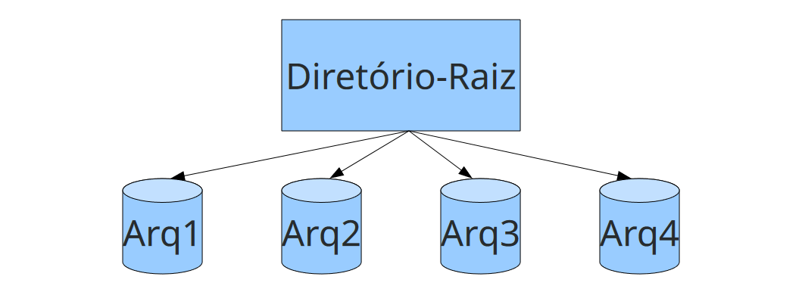
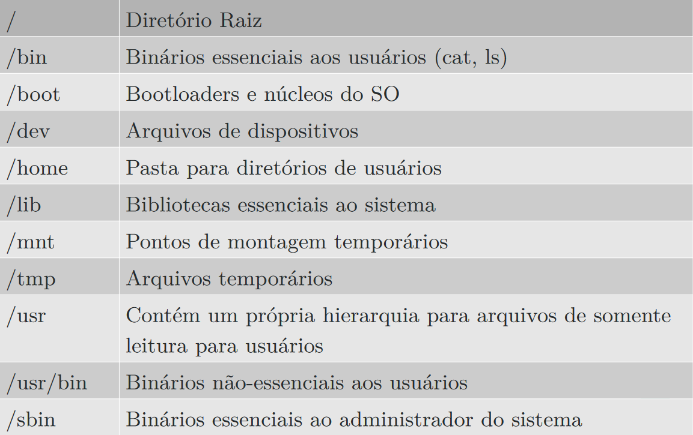

- Armazenamento de informações a longo prazo:
1. Deve ser possível armazenar uma quantidade muito grande de informações
2. As informações devem sobreviver ao término do processo que as está utilizando
3. Múltiplos processos têm de ser capazes de acessá-las ao mesmo tempo

# Atributos de Arquivos

1. Proteção: Quem tem acesso ao arquivo e qual o modo
2. Criador: Quem criou o arquivo
3. Proprietário: O atual dono do arquivo
4. Flag de acesso aleatório: Indicando se pode ser efeito acesso aleatório ou se deve ser sequencial
5. Tamanho: O Tamanho atual do arquivo

# Diretórios

- Os diretórios são utilizados para organizar logicamente os arquivos contidos no disco.

## Sistemas de diretório em nível único

São a forma mais simples de um sistema de diretórios

Há um diretório contendo todos os arquivos chamado de diretório raiz

## Sistemas de diretório em níveis hierárquicos

É possível criar um diretório dentro de outros diretórios, gerando então uma estrutura de árvore

# Arquivos de Sistema

São Bibliotecas compartilhadas, daemons de gerência de rede, arquivos temporários, entre outros.

FHS é um padrão mantido pela Linux Foundation inspirado pelo antigo Filesystem Standard dos sistemas UNIX

# Gerência de Espaço Livre em Disco

responsável por manter informações de quais blocos não estão sendo utilizados no disco

# Gerência de Alocação de Espaço

Responsável por dizer quais blocos petencem a quais arquivos

