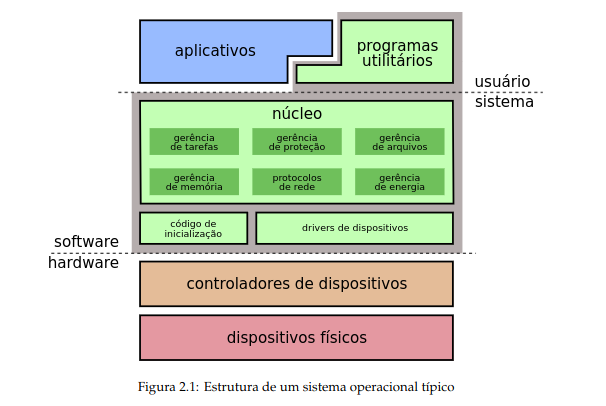

# Noção Base de Sistema

Sistema Operacional é programa ou conjunto de programas.

- Hardware: componentes físicos
- Software: conjunto de todos os programas

Tanenbaum: a maioria dos SOs possuem dois
modos de operação: modo protegido (modo kernel)
e modo usuário

# Definição de Sistema Operacional:

- O SO é a parte fundamental de software que executa em modo protegido, onde possui acesso a todo hardware e pode executar qualquer instrução que a máquina é capaz de executar.

- Machado & Maia: A grande diferença entre um sistema operacional e aplicações convecionais é a maneira como suas rotinas são executadas.

- A rotina é executado concorrentemente em função de eventos assíncronos.

# Qual a função de um sistema operacional:

- Um sistema operacional possui duas grandes funções: Criar para o usuário uma abstração do hardware(máquina estendida) e gerenciar os recursos da máquina.

- Alguns dizem que o sistema operacional é interface da máquina.

OBS: Maquina extendida tem a função de facilitar a visão sobre os recursos da máquina e esconder tal complexidade do hardware.

# Computador

- O computador é um conjunto de recursos que serão compartilhados.

- O sistema operacional deve proteger esses recursos, especialmente em ambientes com multiplos usuários.

# Gerenciador de Recursos

Exemeplos típicos de gerenciamentos

- Uso da CPU: um programa só pode sar a CPU durante um periodo determinado pelo escalonador.

- Uso de Memória: Um programa deve ser interropido caso use memoria que lhe pertence. (segmentation Fault).

- Para todo recurso, o SO deve: Manter informações sobre o resumo(endereço, estados), Decidir quem pode acessar o recurso, Alocar o recurso, etc.

- E importante que o gerenciamento seja eficiente, maximize a utilização dos recursos e ter um tempo previsível de resposta.