# Processos

## Definição

- Um processo é um programa em execução acompanhando de valores de tempo de execução

- O processo deve ser visto como uma unidade de contexto, ou seja, um contêiner de recursos utilizados por uma ou mais tarefas para sua execução: áreas de memória (código, dados, pilha), informações de contexto e descritores de recursos
do núcleo (arquivos abertos, conexões de rede, etc).

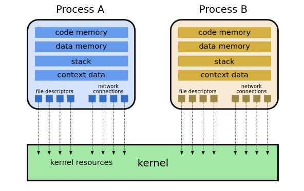

## Elementos de um processo

- Código executável
- Pilha de execução: contendo valores de variáveis locais
- Apontador para pilha: registrador da CPU que
armazena em qual área de memória está a pilha
- Contador de programa: registrador da CPU que
armazena a próxima instrução a ser executada
- Valores dos registradores gerais da máquina

## Classificação dos modelos

 - Processos quanto ao custo de troca de contexto e de manutenção

- Heavyweight(Processo tradicional)
- Lightweight(threads)

## Heavyweight

- O processo é composto tanto pelo ambiente como pela a execução

Os processos são criados:

- Início do sistema
- Execução de uma chamada ao sistema de criação de processo por um processo em execução
- Requisição do usuário
- Início de um job de lote

## Inicializar do SO

- Alguns executam em primeiro plano e interagem
com usuários

- Outros executam em segundo plano: chamados
de daemons

Daemons: é um processo em segundo plano que executa tarefas específicas de forma autônoma e contínua, sem a necessidade de interação direta com o usuário.

- Geralmente os processos são criados por outro

Hierarquia em árvore:

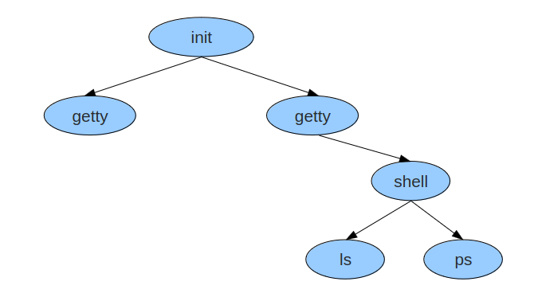

## Criação de processo no Unix

```
fork();
```

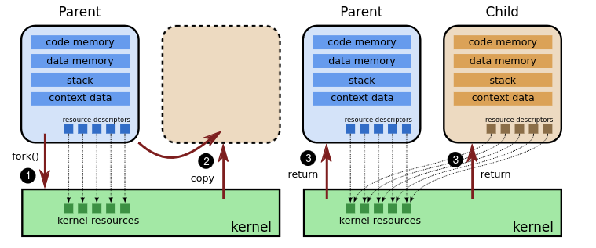

- Clone idêntico ao processo que chamou
- Normalmente, executa execve depois da chamada para mudar o "programa" em execução

## Condições de término de processos:

- Saída normal (voluntária)
- Saída por erro (voluntária)
- Erro fatal (involuntário)
- Cancelamento por outro processo (involuntário)

## Hierarquia de processos

- Quando um processo é criado por outro, eles continuam assoaciados.
- Em alguns sistemas, é possivel listar o ppid (parent pid)
- Todos os processos são filhos ou descendentes dos processos init.

## Estados dos processos

Estados de um processo: Rodando, Bloqueado, Pronto

- Quando o processo está esperando um evento, dizemos que ele está bloqueado:

Leitura em disco -> Leitura de rede -> Esperando entrada de usuário

Representação de estados de um processo

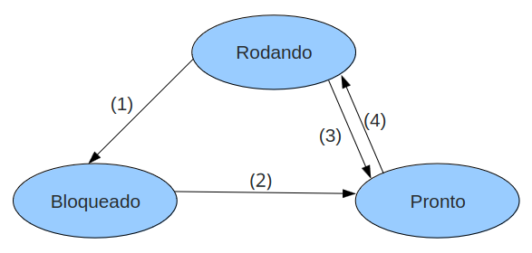

(1) O processo bloqueia-se aguardando uma entrada

(2) O evento aguardado pelo processo ocorreu, pode-se iniciar a executar.

(3) O tempo de posse do processador esgotou-se

(4) O processo é escolhido pelo escalonador para executar

## CPU Bound e I/O Bound

- CPU Bound: são tarefas que usam intensivamente o processador na maior parte de sua existência. Essas tarefas passam a maior parte do tempo nos estados pronta ou executando.

- I/O Bound: São tarefas que dependem muito mais dos dispositivos de entrada/saída que do processador. Essas tarefas ficam boa parte de suas existências no estado suspenso, aguardando respostas às suas solicitações de leitura e/ou escrita de dados nos dispositivos de entrada/saída.

## Implementação de processos

### Troca de contexto: 

- Operação de salvamento dos registradores de um processo e posterior restauração de registradores de outro processo.

- A troca de contexto permite a troca de processador entre os processos

- Cada dispositivo de E/S possui possui uma área
de memória chamada vetor de interrupções

#### Diagrama temporal 

Principais passos envolvidos em uma troca de contexto:

1. Uma tarefa A está executando;
2. Ocorre uma interrupção do temporizador do hardware e a execução desvia para
a rotina de tratamento, no núcleo;
3. A rotina de tratamento ativa o despachante;
4. O despachante salva o estado da tarefa A em seu TCB e atualiza suas informações
de gerência;
5. Opcionalmente, o despachante consulta o escalonador para escolher a próxima
tarefa a ativar (B);
6. O despachante resgata o estado da tarefa B de seu TCB e a reativa.

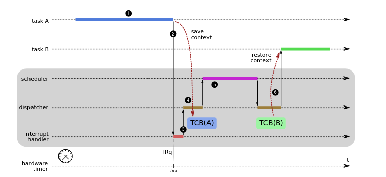

## Escalonador de Processos

- O Sistema Operacional é responsável por gerenciar o(s) recurso(s) de processamento de um computador por meio de sua atividade chamada <strong>Escalonador de Processador</strong>

- Os escalonadores podem ser classificados como Preemptivos ou Cooperativo(Não-Preemptivos).

A preempção é a suspensão temporária da execução de um processo.

### Sistemas preemptivos:

- Nestes sistemas uma tarefa pode perder o processador caso termine seu quantum de tempo, caso execute uma chamada de sistema ou caso ocorra uma interrupção que acorde uma tarefa mais prioritária (que estava suspensa aguardando um evento). A cada interrupção, exceção ou chamada de sistema, o escalonador reavalia todas as tarefas da fila de prontas e decide se mantém ou substitui a tarefa atualmente em execução.

- Cada Processo tem seu tempo(time-slice) de posse do processador

- O controle de tempo de execução é feito por interrupção

### Sistemas cooperativos:

- A tarefa em execução permanece no processador tanto quanto possível, só liberando o mesmo caso termine de executar, solicite uma operação de entrada/saída ou libere explicitamente o processador1, voltando à fila de tarefas prontas. Esses sistemas são chamados de cooperativos por exigir a cooperação das tarefas entre si na gestão do processador, para que todas possam executar.

- Nenhuma entidade externa “tira a CPU à força”
do processo

### Critérios do Escalonador

- Justiça: garantir que todos os processos terão
chances justas de uso de processador.

- Eficiência: quando existir trabalho a fazer, o
processador deve estar ocupado.

- Minimizar o tempo de resposta: reduzindo o
tempo dos usuários interativos, reduz o tempo entre
a entrada de usuário e a resposta dada (não
considera tempo total de execução).

- Minimizar o turnaround: reduzir o tempo desde
o lançamento do processo até seu término. Soma de:
tempo de espera por recursos (memória,
processador, E/S) e tempo de utilização da CPU.
Mais utilizado em processamento batch.

- Minimizar waiting time: Esse critério visa
minimizar o tempo de espera pela CPU

- Maximizar throughtput: Maximizar o
número de tarefas executados em uma unidade
de tempo

## Algoritimos clássicos de escalonamento

Sendo eles: First Come First Served, Round-Robin, Prioridades, Shorteste Job First

### First Come First Served(FCFS)

- O processo obtém a CPU de acordo com a ordem da chegada das solicitações. o processo que pede a CPU primeiro, obtém a CPU em primeiro lugar

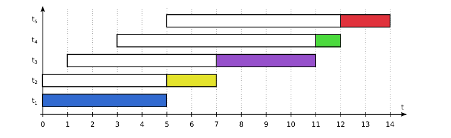

- O escalonador FCFS é <strong>Não-preemptivo</strong>

- Um processo CPU/bound pode fazer com que vários processos esperem por um tempo indeterminado.

#### Vantagens

- Simples de ser implementado
- Algoritmo efieciente: CPU sempre é utilizada

#### Desvantagens

- Impossibilidade de se prever quando um processo vai iniciar
- Tempo de espera não é priorizado

### Round-Robin

- Cada processo tem o direito de usar o processador por um intervalo de tempo pré-definido. Este intervalo de tempo é denominado quantum

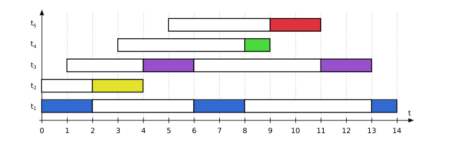

- Algoritmo por alternância circular

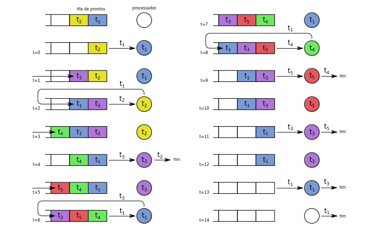

- Algoritmo justo

- Dificuldade de determinar bom quantum para ser atribuído;

- Sendo assim, Quantum muito longo: FCFS e Quantum muito curto: perda de vários requisitos, tais como eficiência.

- Para o algoritmo ser eficiente é necessário que o tempo de troca de contexto seja consideravelmente menor que a execução do programa

### Escalonamento com prioridades

- Cada processo é atribuída uma prioridade. Processos com prioridade maior rodam primeiro

- Prioridades podem ser atribuídas de duas
formas: estática ou dinâmica

#### Estática

- Os processos são divididos em classes e a cada classe é atribuída uma prioridade. A cada prioridade existe uma fila de prontos associada

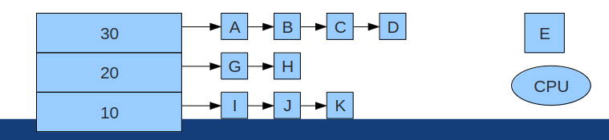

#### Dinâmica 

- O sistema analisa o comportamento dos processos e atribui prioridades favorecendo um certo tipo de comportamento

- Processos I/O devem possuir prioridade alta
- Prioridade dinâmica: 1/f, onde f é a fração do
quantum de tempo usada na última rodada do
processo

### Shortest Job First

- Dado um conjunto de processos, execute os de menor tempo de execução antes.

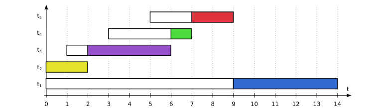

#### Vantagens

- Projetado para sistemas em lotes
- Diminui o tempo de turnaround(tempo de
lançamento do processo até seu término)

#### Desvatagens

- Requer que o tempo total de execução do
processo seja conhecido antes do seu início

## Threads

### Definição:

- Uma thread é definida como sendo um fluxo de execução independente. Um processo pode conter uma ou mais threads, cada uma executando seu próprio código e compartilhando recursos com as demais threads localizadas no mesmo processo.

- Permitem que múltiplas execuções ocorram no mesmo ambiente.

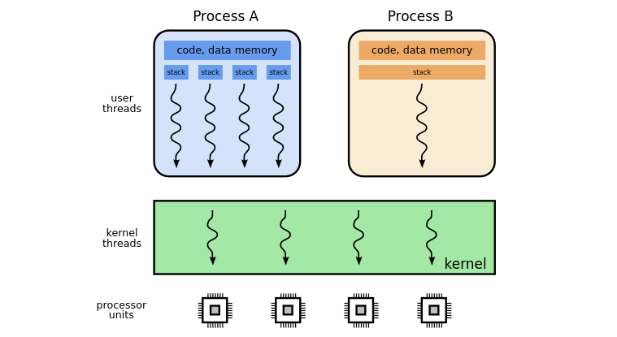

Na figura, o processo A tem várias threads, enquanto o processo B é sequencial (tem uma única thread).

- No modelo multithread, a entidade processo é dividida em processo e thread.

- O processo corresponde ao ambiente

- Thread corresponde ao estado da execução

- Um processo é composto por várias threads que compartilham o ambiente: memória, descritor de arquivos, entre outros.

- Threads compartilham as mesmas variáveis globais

- A proteção dos recursos entre threads é responsabilidade do programador

- São necessários mecanismos de sincronização

- A pilha é uma estrutura em memória, porém
cada thread possui a sua própria pilha e não
compartilha esses dados com as outras threads

- Threads são mais fáceis de criar e destruir do que processos, afinal apenas área de execução precisa ser alocada

### Implementação de Threads

#### Implementar em nível de SO

- O SO deve se tornar responsável por isso

- Criar abstrações de processos e de threads

- Implementar o modelo de processos heavyweight e simular múltiplas threads através de bibliotecas

- Mais viável em SO com kernel não-monolítico

- O kernal deve criar as threads, organizar seu escalonador e término

- Existência de uma tabela de threads no kernel, que contém os dados de cada thread

- Quando uma thread é bloqueada, o kernel é responsável por escalonar outra thread para rodar, mesmo que seja de outro processo.

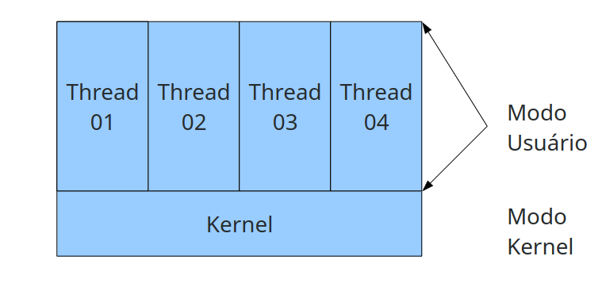

#### Implementação em nível usuário

- As threads são simuladas no processo de usuário

- Cada processo precisa de sua própria tabela de threads

- Threads manipuladas por funções

- Geralmente, o escalonador do SO é não-preemptivo

- Quando uma thread for perder o controle, ela chama um procedimento do ambiente de execução para selecionar outra thread para executar

- Troca de contexto muito rápida entre as threads

- Cada processo pode ter seu próprio algoritmo de escalonamento. Muitas vezes, o tipo de algoritmo de escalonamento é melhor para certos problemas.

- Se a chamada realmente for bloquear, ela só é realizado caso não exista thread para executar

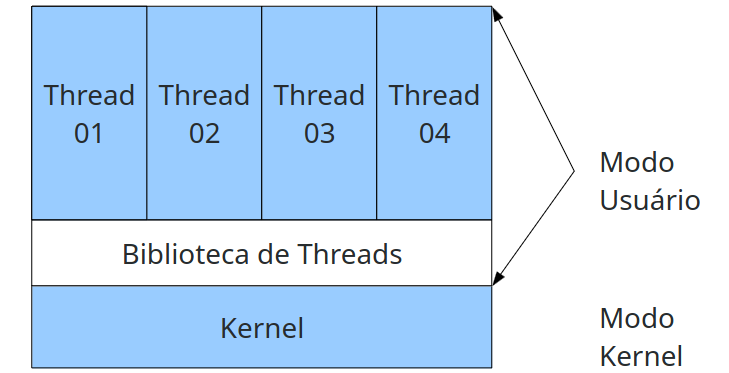

Comparação entre Threads em nível usuário e nível SO

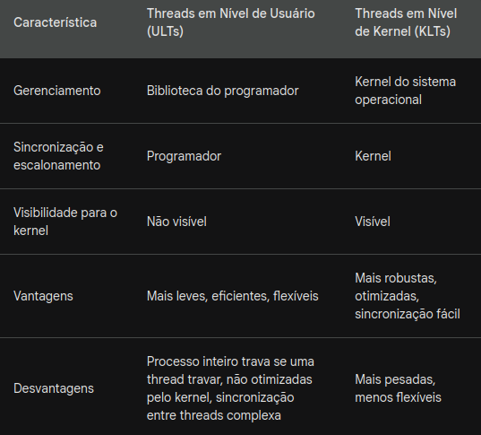

#### Implementação em modo híbrido

- As arquiteturas de threads no modo híbrido busca combinar as vantagens das threads em modo usuário e threads em modo kernel.

- Um processo pode ter várias threads de kernel.

- Por sua vez, cada thread kernel pode conter diversas threads em modo usuário.

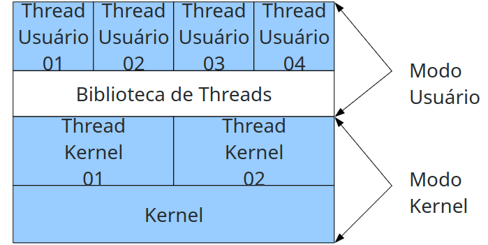

- Pacote POSIX threads(pthreads) Biblioteca amplamente utilizada para suportar threads.

- Inclui mecanismo de controle e sincronização

### Modelo de execução de threads

- Threads dinâmicas: onde uma thread é criada para tratar cada requisição

- Thread estática: o número de threads é fixo

#### Modelo despachante (Dispatcher)

- Responsável por receber o trabalho, mas não o processa.

- O despachante seleciona uma thread trabalhadora para entregar o trabalho

- A thread trabalhadora executa a solicitação e sinaliza o dispatcher

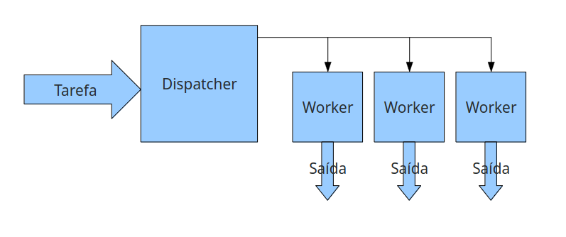

Ex: Servidor Web

1. Um servidor web recebe várias requisições de diversos clientes.

2. As requisições podem envolver leitura de disco

3. Se a mesma thread é responsável por receber uma nova requisição e ler o disco, pode-se ter um problema. Especialmente se o equipamento de rede for mais rápido que o disco

##### Vantagens:

- Consumo rápido de mensagens

- Boa distribuição de requisições

- Flexibilidade: podemos facilmente mudar os números de threads

##### Desvantagens

- Pouco uso de CPU pela thread despachante, Em alguns benchmarks pode considerar apenas 80% do uso total da CPU.

#### Modelo Time

- As threads são autômas e gulosas por serviços. Elas acessam um "poll" de tarefa, obtem e as executam.

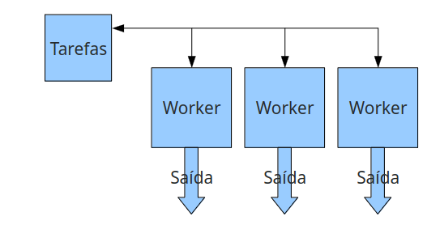

##### Vantagens

- Bom consumo de mensagens

- Boa distribuição de requisições

- Flexibilidade em mudar o número de tarefas

#### Desvantagens

- Cuidado na implementação. Em computadores modernos, uma thread inicia o programa e deve ser responsável por criar todas as outras. Após isso, ela deve se tornar uma thread normal do time.

### Modelo Pipeline

- Cada thread realiza uma tarefa específica produzindo dados de entrada de outra thread. Os dados de saída final são produzidos pela última thread


#### Desvantagem

- Se uma thread for muito mais lenta que as outras, todo o processamento é desperdiçado.

- Muitas vezes não e fácil dividir a tarefa em um pipeline.

### Condição de corrida

Considere os seguinte Processos/Thread incrementando
uma variável em memória compartilhada

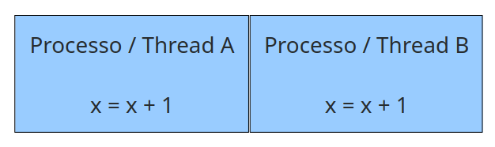

Considere, x = 0

Assumindo que X está na posição de memória 0x2000

<strong>Escalonador: A -> B</strong>

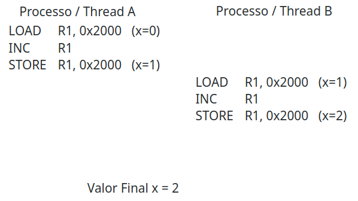

<strong>Escalonador: A -> B -> A</strong>

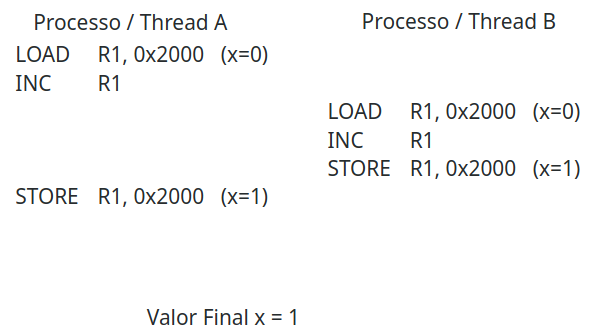

### Exclusão Mutual

- É um mecanismo de sincronização em programação concorrente que garante que apenas um processo ou thread possa acessar uma seção crítica de código por vez.

#### Variável de impedimento

- Variável de impedimento busca marcar se existe
alguém na seção crítica. Se for 1, não procede

```
int thread() {
    while(true) {
        while (busy == 1) {}
        busy = 1;
        regiao_critica();
        busy = 0;
    }
}
```

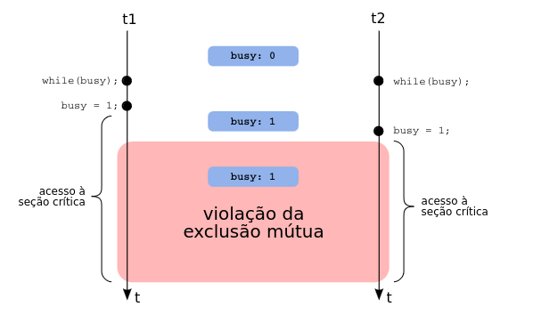

- Se ocorrer uma troca de contexto depois de sair do loop e antes do processo/thread trocar o valor para 1, há uma condição de corrida.

#### Para uma boa exclusão mutual

- Somente um processo pode estar nas regiões críticas

- Nada pode ser afirmado sobre a velocidade ou sobre o número de CPUs

- Nenhum processo executando fora de sua região crítica pode bloquear outros processos

- Nenhum processo deve esperar eternamente para entrar em sua região crítica.

#### Técnicas para implementação de exclusão mútual

Inibir interrupções

Com espera ocupada:

- Estrita Alternância
- Algoritmo de Peterson
- Utilizar hardware adicional

Com bloqueio de processos:

- Semáforos
- Mutexes
- Locks
- Monitores
- Variáveis de condição

#### Inibir interrupções

1. <strong>Desativar interrupções:</strong> Antes de entrar na seção crítica, a thread desativa as interrupções do processador. Isso impede que outras threads interrompam a execução da seção crítica.

2. <strong>Executar a seção crítica:</strong> Com as interrupções desativadas, a thread executa o código da seção crítica sem a interferência de outras threads. Isso garante que os dados compartilhados sejam acessados e modificados de forma consistente.

3. <strong>Reativar interrupções:</strong> Ao finalizar a seção crítica, a thread reativa as interrupções do processador, permitindo que outras threads retomem a execução normal.

- Função aplamente utilizada apenas em modo kernel, o programador no espaço usuário não tem acesso à essa chamada.

#### Espera ocupada/Busy waiting

```
while (vez != minha) { };
```

- Desperdiça o tempo que possui CPU fazendo um teste trivial.

- A espera ocupada desperdiça o tempo que possui CPU fazendo um teste trivial

- Deve ser utilizada quando há uma expectativa de
esperar pouco/muito pouco.

- Algumas vezes obrigatória em modo kernel.

#### Estrita alternância

-  Estrita alternância resolve o problema da
exclusão mútua para dois processos.

- A ideia é que um processo marque que está na seção crítica.

- Outro processo aguarda a saída.

```
int turn = 0 // var global

int thread_A() {
    while(true) {
        while(turn != 1);
        região_critica();
        turn = 0;
        regiao_nao_critica();
    }
}

int thread_B() {
    while(true) {
        while(turn != 0);
        região_critica();
        turn = 1;
        regiao_nao_critica();
    }
}
```

#### Desvantagens

- a estrita alternância não deve ser utilizada quando um processo é muito mais lento do que outro.

- É bem implementada em processos iguais

- Ela viola a regra de um processo fora da seção crítica bloquear outro processo

- Não é uma solução genérica

#### Algoritmo de Peterson

- Esse algoritmo minimizou o número de loops e comparações necessárias

- Garante a exclusão mútua

- Os processos possuem um id único (0 ou 1)

- O processo deve chamar uma função enter_region, que retorna só quando for seguro entrar na seção

- Ao terminar o processamento, a função leave_region deve ser chamada para indicar que outros processos podem prosseguir

- Isso garante que um processo fora da seção crítica não bloqueie outros


